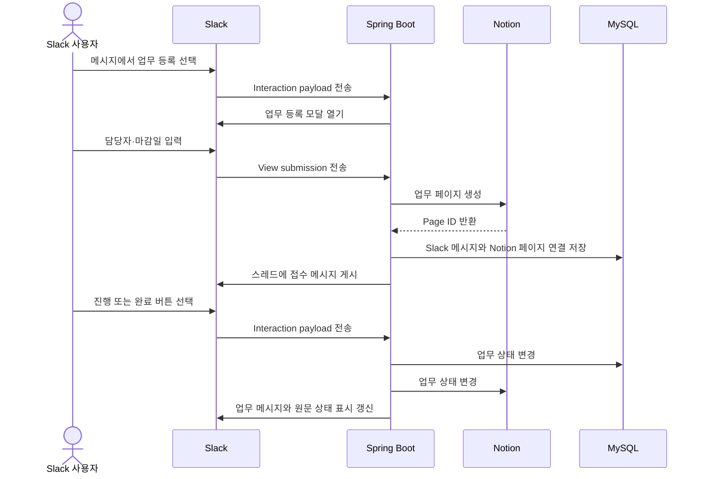
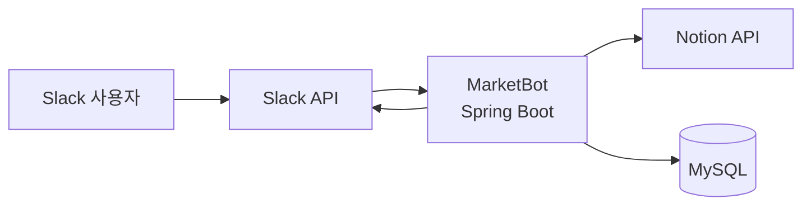

# MarketBot

> Slack 메시지를 추적 가능한 업무로 전환하고 Notion과 진행 상태를 동기화하는 업무 관리 자동화 PoC

MarketBot은 Slack으로 들어오는 요청 중 후속 관리가 필요한 메시지를 업무로 등록하고, 담당자와 진행 상태를 Slack 안에서 관리할 수 있도록 만든 개인 프로젝트입니다. 등록된 업무는 Notion 데이터베이스에 구조화하여 비개발자도 쉽게 조회하고 수정할 수 있습니다.

| 항목 | 내용 |
| --- | --- |
| 개발 목적 | Slack 요청의 누락 방지와 담당자·진행 상태 가시화 |
| 핵심 연동 | Slack API ↔ Spring Boot ↔ Notion API |
| 데이터 저장 | Slack 사용자 및 Slack 메시지–Notion 페이지 연결 정보 |
| 프로젝트 성격 | 현업에서 관찰한 문제를 바탕으로 한 개인 PoC |

> 조직의 운영 방향과 우선순위로 인해 실제 사내 도입 및 성과 측정까지 이어지지는 않았습니다. 따라서 이 프로젝트는 운영 성과가 아니라 문제 정의, 기술 선택, 외부 API 연동 및 핵심 사용자 흐름의 구현에 초점을 둡니다.

## 개발 배경


업무 요청과 전화 문의를 Slack을 통해 전달받았지만, 즉시 처리하지 못한 요청을 별도로 추적할 공통 수단이 없어 누락되거나 처리가 지연될 가능성이 있었습니다.

또한 요청마다 담당자가 명확하게 지정되지 않아 다음과 같은 정보를 파악하기 어려웠습니다.

* 각 요청의 담당자와 현재 진행 상태
* 팀원별로 진행 중인 업무
* 당일 접수되거나 처리된 업무
* 완료되지 않은 요청과 후속 조치가 필요한 업무

이 문제를 해결하기 위해 **Slack으로 접수된 요청을 Notion 데이터베이스에 등록하고 관리할 수 있는 Slack–Notion 연동 기능**을 구현했습니다.

Notion은 기존에 사용하던 업무 도구는 아니었지만, 실제 업무를 담당하는 팀원 대부분이 비개발자였기 때문에 MySQL에 저장된 데이터를 직접 확인하거나 관리하기 어려웠습니다. 따라서 별도의 관리자 페이지를 개발하는 것보다 짧은 기간 안에 구현할 수 있고, 비개발자도 쉽게 조회·수정할 수 있는 Notion을 업무 관리 화면으로 선택했습니다.

별도의 관리자 화면을 새로 개발하는 대신 Notion을 관리 화면으로 활용하여 구현 범위를 줄였고, 요청별 담당자, 진행 상태, 요청 내용과 처리 내역을 한곳에서 확인할 수 있도록 구성했습니다. 동시에 사용자가 익숙한 Slack을 벗어나지 않고 업무를 등록하고 상태를 변경할 수 있도록 했습니다.

실제 조직 도입으로 이어지지는 않았지만, 개인 PoC로 전환하여 업무 등록부터 상태 동기화와 개인 업무 조회까지 핵심 흐름을 구현했습니다.

## 주요 기능

### Slack 메시지를 업무로 등록

- 메시지 바로가기에서 업무 등록 모달 실행
- 원본 메시지 내용과 사용자 멘션을 초기값으로 활용
- 제목, 업무 유형, 담당자, 참조자, 담당 팀, 마감일 입력
- Slack 원문 링크와 함께 Notion 데이터베이스에 업무 생성
- 원본 메시지의 스레드에 업무 접수 결과 게시

### Slack과 Notion 상태 동기화

- Slack 버튼으로 `접수 → 진행 → 완료` 상태 변경
- 담당자만 상태를 변경할 수 있도록 권한 확인
- 담당자가 아닌 사용자의 상태 변경 시도는 개인 메시지로 안내
- 버튼 클릭 시 Slack 메시지, MySQL, Notion의 상태 갱신
- 원본 메시지의 👀·✅ 이모지는 현재 상태를 보여주는 표시로만 사용
- 수정 모달을 통해 등록된 업무 내용 변경

### 개인 업무 현황 조회

- `/업무현황` 명령어로 내 미완료 업무 조회
- 오늘 완료한 업무를 함께 조회
- 외부 API 조회가 Slack의 응답 제한을 막지 않도록 비동기 처리 후 `response_url`로 결과 전달

### 사용자 정보 동기화

- Slack 워크스페이스의 사용자 목록을 MySQL에 동기화
- Slack 사용자 ID와 표시 이름, 담당 팀을 업무 처리에 활용

## 동작 흐름



## 시스템 구성



- **Slack**: 사용자 인터페이스, 이벤트 및 명령 전달
- **Spring Boot**: 상호작용 처리, 업무 규칙 적용, 외부 API 연동
- **Notion**: 업무 목록과 속성 저장
- **MySQL**: Slack 사용자 및 Slack 메시지–Notion 페이지 연결 정보 저장

## 기술 스택

| 구분 | 기술 |
| --- | --- |
| Language | Java 21 |
| Framework | Spring Boot 4, Spring Web, Spring Data JPA |
| Database | MySQL |
| External API | Slack Web API, Slack Interactivity API, Notion API |
| Build | Gradle |
| Local webhook | Cloudflare Tunnel |

## 설계 과정에서 고민한 점

### 모든 요청이 아닌, 추적이 필요한 요청만 등록

즉시 해결할 수 있는 단순 문의까지 저장하면 입력과 관리 비용이 커집니다. 자동 수집 대신 메시지 바로가기를 사용하여 사용자가 후속 관리가 필요하다고 판단한 요청만 등록하도록 했습니다.

### 상태 변경 경로를 버튼으로 단일화

이모지와 버튼을 모두 상태 입력 수단으로 사용하면 동일한 상태를 변경하는 경로가 두 개가 되어 Slack, MySQL, Notion 사이의 일관성을 유지하기 어려워집니다. 따라서 담당자 권한을 확인할 수 있는 버튼만 상태 변경에 사용하고, 원본 메시지의 이모지는 현재 상태를 빠르게 확인하는 표시 역할로 분리했습니다.

### Slack 메시지와 Notion 페이지의 연결

Slack 상호작용 요청에는 변경할 Notion 페이지 정보가 직접 포함되지 않습니다. MySQL에 Slack 채널·메시지 식별자와 Notion Page ID를 연결해 저장하여, 버튼 요청이 들어왔을 때 변경할 Notion 업무를 찾을 수 있도록 했습니다.

### Slack의 짧은 응답 시간 대응

슬래시 명령어 요청을 받은 뒤 Notion 조회를 모두 기다리면 Slack의 응답 제한을 넘길 수 있습니다. 요청에는 먼저 응답하고, 비동기로 조회한 결과를 Slack의 `response_url`에 전달하도록 구성했습니다.

## 로컬 실행

### 사전 요구사항

- Java 21
- MySQL
- 개인 Slack 워크스페이스와 Slack App
- 개인 Notion Integration과 Database
- 외부 webhook 테스트를 위한 `cloudflared`

회사 또는 제3자의 토큰과 실제 업무 데이터는 사용하지 마세요.

### 1. 설정 파일 생성

[`application.example.properties`](src/main/resources/application.example.properties)를 복사하여 `src/main/resources/application.properties`를 만들고 개인 테스트 환경의 값을 입력합니다.

```properties
slack.bot.token=
slack.workspace=
slack.digest.channel-id=

external-api.connect-timeout=3s
external-api.read-timeout=5s

notion.token=
notion.database.id=
notion.version=

spring.datasource.url=
spring.datasource.username=
spring.datasource.password=
```

`application.properties`는 Git에서 제외됩니다. 빌드 결과물에도 설정 파일이 포함될 수 있으므로, 실제 토큰이 포함된 JAR 파일을 공유하지 마세요.

### 2. 애플리케이션 실행

Windows PowerShell:

```powershell
.\gradlew.bat bootRun
```

기본 포트는 `8080`입니다.

### 3. 로컬 서버 공개

별도의 PowerShell에서 Quick Tunnel을 실행합니다.

```powershell
cloudflared tunnel --url http://localhost:8080
```

출력된 `https://*.trycloudflare.com` 주소를 Slack App 설정에 등록합니다.

| Slack 설정 | Request URL |
| --- | --- |
| Interactivity | `https://{tunnel-domain}/slack/interaction` |
| Slash Command | `https://{tunnel-domain}/slack/command` |

Quick Tunnel 주소는 다시 실행할 때 변경되며 개발·데모 용도로만 사용합니다.

### 4. Slack 사용자 동기화

앱 실행 후 다음 API를 한 번 호출하여 Slack 사용자 정보를 저장합니다.

```http
POST /admin/slack/users/sync
```

현재 이 엔드포인트에는 관리자 인증이 없으므로 개인 테스트 환경에서만 사용해야 합니다.

### 5. 테스트 실행

```powershell
.\gradlew.bat test
```

## 데모 시나리오

1. Slack에 후속 조치가 필요한 가상의 문의 메시지를 작성합니다.
2. 메시지 메뉴에서 업무 등록 Shortcut을 선택합니다.
3. 담당자, 참조자, 업무 유형과 마감일을 입력합니다.
4. Notion에 업무가 생성되고 Slack 스레드에 접수 메시지가 게시되는지 확인합니다.
5. 담당자가 진행 또는 완료 버튼을 눌러 Slack 메시지와 Notion 상태가 변경되는지 확인합니다.
6. `/업무현황` 명령어로 미완료 업무와 오늘 완료한 업무를 조회합니다.

## 구현 범위와 한계

현재 버전은 핵심 사용자 흐름의 기술적 가능성을 검증한 PoC입니다. 실제 조직에 배포되지 않았으므로 사용자 수, 업무 누락 감소율, 처리 시간 단축과 같은 운영 지표는 측정하지 않았습니다.

또한 현재 구현에는 다음과 같은 기술적 한계가 있습니다.

- 관리자 API 인증이 적용되지 않았습니다.
- Slack의 중복 이벤트 전송에 대한 멱등성을 보장하지 않습니다.
- Slack 또는 Notion API가 일부만 성공하면 서비스 간 상태가 일시적으로 달라질 수 있습니다.
- 외부 API의 자동 재시도 정책과 실패 작업 복구 수단이 충분하지 않습니다.
- 핵심 도메인 규칙과 외부 API 연동에 대한 자동화 테스트가 부족합니다.

따라서 회사 또는 제3자의 실제 데이터와 토큰을 사용한 운영 환경 배포를 권장하지 않습니다.

## 개선 계획

운영 안정성을 먼저 확보한 뒤 사용자 편의 기능을 확장할 계획입니다.

### 1. 보안과 안정성

- [x] `X-Slack-Signature`와 timestamp를 이용한 Slack 요청 검증
- [ ] 관리자 API 인증 및 접근 제어
- [ ] 이벤트 ID를 이용한 중복 요청 방지
- [x] 외부 API 연결 및 응답 timeout 적용
- [ ] 요청 특성을 고려한 재시도 및 실패 복구 정책 적용
- [ ] 민감정보의 환경변수 기반 주입

### 2. 테스트와 코드 품질

- [ ] 담당자 권한과 상태 우선순위 규칙 단위 테스트
- [ ] Slack·Notion API 응답을 재현하는 연동 테스트
- [x] 구조화된 로깅 적용 및 민감한 payload 출력 제거
- [ ] 예외 처리 정책 통일

### 3. 사용자 편의 기능

- [ ] 퇴근 전 개인별 미완료 업무 자동 알림
- [ ] 당일 완료 업무 요약 메시지

## 프로젝트를 통해 검증한 것

- 사용자가 익숙한 Slack 흐름을 유지하면서 필요한 요청만 업무로 구조화하는 방식
- 별도의 관리 화면 대신 Notion을 활용하여 초기 구현 범위를 줄이는 방식
- 서로 다른 식별 체계를 사용하는 Slack 메시지와 Notion 페이지를 연결하는 방식
- 버튼으로 상태 변경 경로를 단일화하고 이모지는 상태 표시로 분리하는 방식
- Slack의 응답 시간 제약을 피하기 위한 비동기 조회 및 후속 응답 방식

이 프로젝트는 현장에서 관찰한 문제를 요구사항으로 구체화하고, 제한된 범위 안에서 해결 방식을 기술적으로 검증한 개인 PoC입니다.
