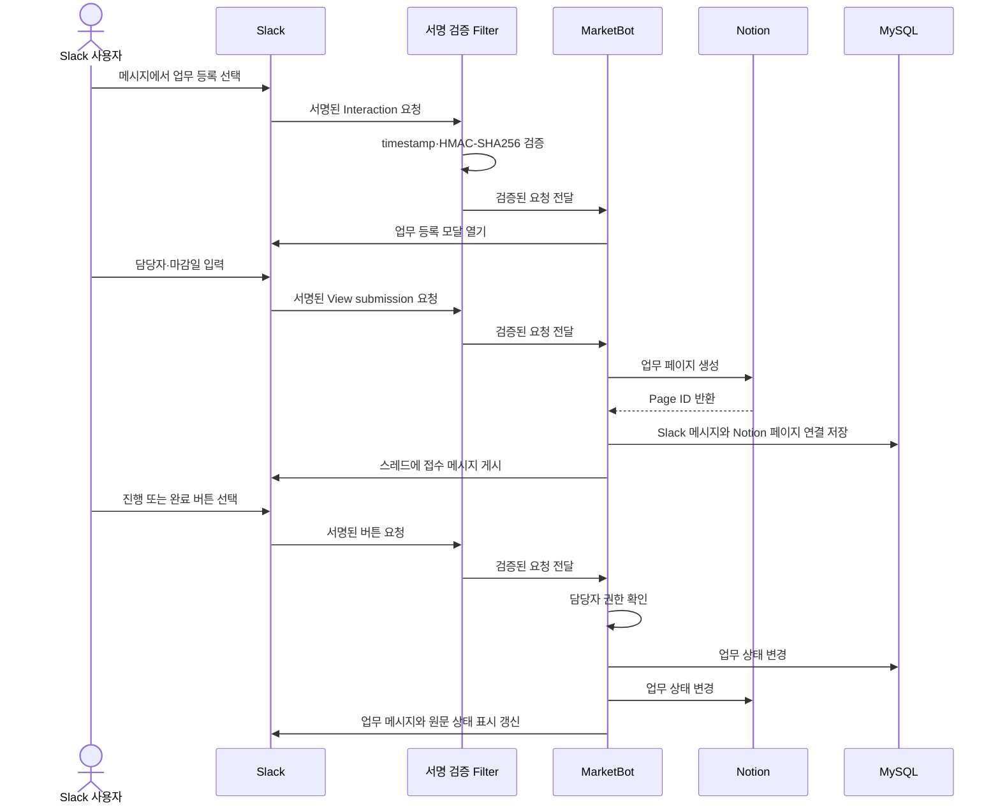
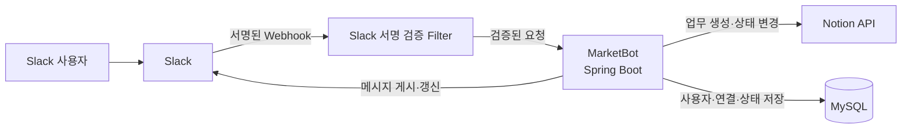

# MarketBot

> Slack 메시지를 추적 가능한 업무로 전환하고 Notion과 진행 상태를 동기화하는 업무 관리 자동화 PoC

MarketBot은 Slack으로 들어오는 요청 중 후속 관리가 필요한 메시지를 업무로 등록하고, 담당자와 진행 상태를 Slack 안에서 관리할 수 있도록 만든 개인 프로젝트입니다. 등록된 업무는 Notion 데이터베이스에 구조화하여 비개발자도 쉽게 조회하고 수정할 수 있습니다.

| 항목 | 내용 |
| --- | --- |
| 개발 목적 | Slack 요청의 누락 방지와 담당자·진행 상태 가시화 |
| 핵심 연동 | Slack API ↔ Spring Boot ↔ Notion API |
| 데이터 저장 | Slack 사용자 및 Slack 메시지–Notion 페이지 연결 정보 |
| 프로젝트 성격 | 현업에서 관찰한 문제를 바탕으로 한 개인 PoC |

> 조직의 운영 방향과 우선순위로 인해 실제 사내 도입 및 성과 측정까지 이어지지는 않았습니다. 따라서 이 프로젝트는 운영 성과가 아니라 문제 정의, 기술 선택, 외부 API 연동 및 핵심 사용자 흐름의 구현에 초점을 둡니다.

## 개발 배경

업무 요청과 전화 문의를 Slack을 통해 전달받았지만, 즉시 처리하지 못한 요청을 별도로 추적할 공통 수단이 없어 누락되거나 처리가 지연될 가능성이 있었습니다.

또한 요청마다 담당자가 명확하게 지정되지 않아 다음과 같은 정보를 파악하기 어려웠습니다.

* 각 요청의 담당자와 현재 진행 상태
* 팀원별로 진행 중인 업무
* 당일 접수되거나 처리된 업무
* 완료되지 않은 요청과 후속 조치가 필요한 업무

이 문제를 해결하기 위해 **Slack으로 접수된 요청을 Notion 데이터베이스에 등록하고 관리할 수 있는 Slack–Notion 연동 기능**을 구현했습니다.

Notion은 기존에 사용하던 업무 도구는 아니었지만, 실제 업무를 담당하는 팀원 대부분이 비개발자였기 때문에 MySQL에 저장된 데이터를 직접 확인하거나 관리하기 어려웠습니다. 따라서 별도의 관리자 페이지를 개발하는 것보다 짧은 기간 안에 구현할 수 있고, 비개발자도 쉽게 조회·수정할 수 있는 Notion을 업무 관리 화면으로 선택했습니다.

별도의 관리자 화면을 새로 개발하는 대신 Notion을 관리 화면으로 활용하여 구현 범위를 줄였고, 요청별 담당자, 진행 상태, 요청 내용과 처리 내역을 한곳에서 확인할 수 있도록 구성했습니다. 동시에 사용자가 익숙한 Slack을 벗어나지 않고 업무를 등록하고 상태를 변경할 수 있도록 했습니다.

실제 조직 도입으로 이어지지는 않았지만, 개인 PoC로 전환하여 업무 등록부터 상태 동기화와 개인 업무 조회까지 핵심 흐름을 구현했습니다.

## 주요 기능

### Slack 메시지를 업무로 등록

- 메시지 바로가기에서 업무 등록 모달 실행
- 원본 메시지 내용과 사용자 멘션을 초기값으로 활용
- 제목, 업무 유형, 담당자, 참조자, 담당 팀, 마감일 입력
- Slack 원문 링크와 함께 Notion 데이터베이스에 업무 생성
- 원본 메시지의 스레드에 업무 접수 결과 게시

### Slack과 Notion 상태 동기화

- Slack 버튼으로 `접수 → 진행 → 완료` 상태 변경
- 담당자만 상태를 변경할 수 있도록 권한 확인
- 담당자가 아닌 사용자의 상태 변경 시도는 개인 메시지로 안내
- 버튼 클릭 시 Slack 메시지, MySQL, Notion의 상태 갱신
- 원본 메시지의 👀·✅ 이모지는 현재 상태를 보여주는 표시로만 사용
- 수정 모달을 통해 등록된 업무 내용 변경

### 개인 업무 현황 조회

- `/업무현황` 명령어로 내 미완료 업무 조회
- 오늘 완료한 업무를 함께 조회
- 외부 API 조회가 Slack의 응답 제한을 막지 않도록 비동기 처리 후 `response_url`로 결과 전달

### 사용자 정보 동기화

- Slack 워크스페이스의 사용자 목록을 MySQL에 동기화
- Slack 사용자 ID와 표시 이름, 담당 팀을 업무 처리에 활용

## 동작 흐름

## 시스템 구성

- **Slack**: 별도 화면 없이 업무를 등록·수정하고 상태를 변경하는 사용자 인터페이스
- **서명 검증 Filter**: timestamp와 HMAC-SHA256 서명을 확인하고 위조·재전송 요청 차단
- **Spring Boot**: 담당자 권한과 상태 규칙 적용, Slack·Notion API 연동 조정
- **Notion**: 비개발자가 조회·수정할 수 있는 업무 관리 화면
- **MySQL**: Slack 사용자, 메시지–Notion 페이지 연결 정보와 현재 상태 저장

Slack과 Notion 호출에는 연결 3초, 응답 5초의 timeout을 적용하여 외부 API 지연이 애플리케이션 요청을 장시간 점유하지 않도록 했습니다.

## 기술 스택

| 구분 | 기술 |
| --- | --- |
| Language | Java 21 |
| Framework | Spring Boot 4, Spring Web, Spring Data JPA |
| Database | MySQL |
| External API | Slack Web API, Slack Interactivity API, Notion API |
| Build | Gradle |
| Local webhook | Cloudflare Tunnel |

이 프로젝트는 현장에서 관찰한 문제를 요구사항으로 구체화하고, 제한된 범위 안에서 해결 방식을 기술적으로 검증한 개인 PoC입니다.
