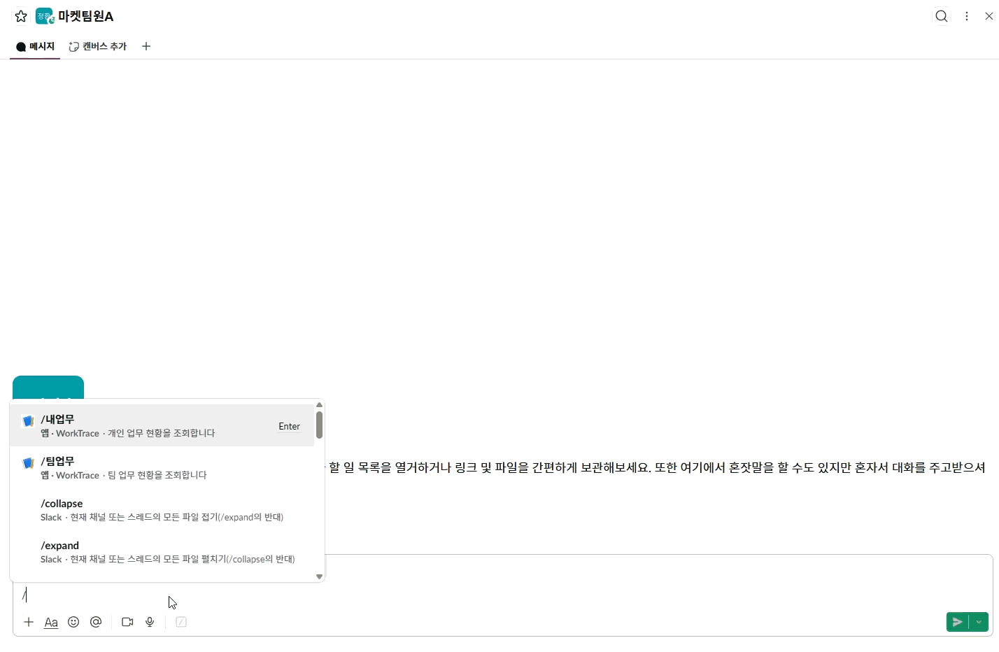
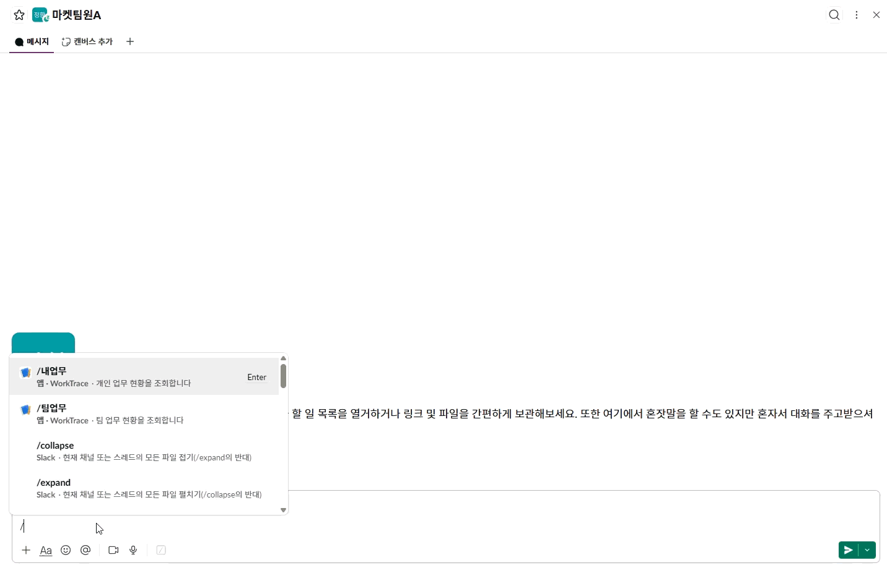
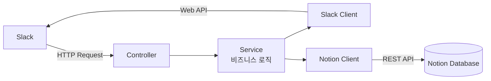

# WorkTrace

> Java·Spring Boot로 구현한 Slack–Notion 연동 업무 추적 자동화 백엔드

Slack의 메시지 바로가기, 이벤트, 슬래시 커맨드를 HTTP 엔드포인트로 처리하고 Notion REST API와 연동했습니다. 업무 등록부터 상태 변경, 개인·팀 현황 조회까지의 비즈니스 로직을 Spring Boot 애플리케이션으로 구현했습니다.

업무 요청은 Slack에서 빠르게 이루어지지만, 메시지가 쌓이면 담당자와 진행 상태를 놓치기 쉽습니다. WorkTrace는 기존 Slack 중심의 소통 방식을 유지하면서 필요한 메시지만 업무로 등록하고, Notion을 팀의 업무 보드로 활용합니다.

## 개발 배경

실제 업무에서는 다른 부서의 요청이나 고객 문의를 Slack 메시지로 전달하고 담당자를 태그해 처리했습니다. 하지만 메시지만으로 업무를 관리하면서 다음 문제가 반복됐습니다.

- 담당자와 처리 여부를 한눈에 확인하기 어려움
- 다른 사람이 처리했을 것이라 생각해 업무가 누락됨
- 오래된 요청이 대화에 묻혀 고객 대응이 지연됨
- 개인 및 팀 업무 현황을 매일 다시 정리해야 함

별도의 업무관리 도구를 새로 학습하거나 Slack 메시지를 다른 서비스에 반복해서 입력하지 않고도 이 문제를 줄일 수 있는지 검증하기 위해 MVP를 개발했습니다.

## 주요 기능

| 기능 | 설명 |
| --- | --- |
| 메시지 바로가기 | Slack 메시지에서 바로 업무 등록 모달을 실행합니다. |
| 입력값 자동 추출 | 원본 메시지 본문과 `cc` 전후의 담당자·참조자를 모달에 채웁니다. 업무명은 사용자가 직접 입력합니다. |
| Notion 자동 등록 | 업무명을 페이지 제목으로, Slack 메시지를 페이지 본문으로 저장합니다. |
| 중복 등록 방지 | 원본 Slack 메시지 URL로 이미 등록된 업무인지 확인합니다. |
| 이모지 상태 연동 | 담당자가 👀을 추가하면 `진행중`, ✅을 추가하면 `완료`로 변경합니다. |
| 개인 업무 조회 | `/내업무`로 미완료 업무와 오늘 완료한 업무를 확인합니다. |
| 팀 업무 조회 | `/팀업무`로 담당자별 업무와 현재 상태를 확인합니다. |

## 동작 화면

### 1. Slack 메시지를 Notion 업무로 등록

메시지 바로가기에서 `업무 등록`을 선택하면 담당자와 참조자를 추출하고, 사용자가 입력한 업무명과 원본 메시지 본문을 Notion에 저장합니다.


### 2. 이모지로 진행 상태 변경

담당자가 원본 메시지에 👀 또는 ✅ 이모지를 추가하면 연결된 Notion 업무의 상태가 변경됩니다. 담당자가 아닌 사용자의 반응은 상태에 반영하지 않습니다.


### 3. 개인 및 팀 업무 조회

별도 관리 화면에 접속하지 않고 Slack에서 바로 업무 현황을 확인합니다.

```text
/내업무  → 내 미완료 업무 + 오늘 완료 업무
/팀업무  → 담당자별 미완료 업무 + 오늘 완료 업무
```

조회 결과는 명령을 실행한 사용자에게만 보이는 메시지로 응답합니다.

#### 내 업무 현황



#### 팀 업무 현황



## 시스템 구조



- **Slack**: 업무가 발생하고 처리되는 사용자 인터페이스
- **Spring Boot**: Slack 이벤트 처리와 업무 흐름 제어
- **Notion**: 업무 데이터 저장소이자 비개발자를 위한 업무 보드

자체 데이터베이스와 별도의 프런트엔드를 두지 않고, MVP의 핵심 업무 흐름을 검증하는 데 집중했습니다.

## 백엔드 구현 범위

외부 요청 처리, 비즈니스 규칙, API 통신의 책임을 분리했습니다.

| 계층 | 역할 |
| --- | --- |
| Controller | Slack의 form-urlencoded·JSON 요청 수신 및 HTTP 응답 |
| Service | 업무 등록, 중복 방지, 상태 전이, 담당자 권한, 조회 범위 처리 |
| Client | Slack Web API와 Notion REST API 요청·응답 처리 |
| DTO | Slack payload와 내부 메타데이터의 구조화 |

| Endpoint | 기능 |
| --- | --- |
| `POST /slack/interactions` | 메시지 바로가기와 업무 등록 모달 처리 |
| `POST /slack/events` | 이모지 추가·제거 이벤트 처리 |
| `POST /slack/commands` | `/내업무`, `/팀업무` 요청 처리 |

Notion 조회는 한 번에 최대 100건씩 페이지네이션하며, Slack 응답 길이 제한을 고려해 출력할 업무 수와 메시지 길이를 제한했습니다.

## 핵심 구현

### 원본 메시지를 기준으로 한 중복 방지

Slack 메시지의 permalink를 Notion에 함께 저장합니다. 같은 메시지를 다시 등록하면 새 페이지를 생성하지 않고 기존 업무를 확인하여 중복 생성을 막습니다.

### 담당자만 상태를 변경

Notion에 담당자의 Slack ID를 저장하고, 이모지 이벤트를 발생시킨 사용자와 비교합니다. 담당자가 추가한 상태 이모지만 Notion에 반영됩니다.

| Slack 반응 | Notion 상태 |
| --- | --- |
| 업무 최초 등록 | 접수 |
| 👀 추가 | 진행중 |
| ✅ 추가 | 완료 |
| ✅ 제거 | 진행중 |
| 👀 제거 | 접수 |

### 업무명과 원문 분리

업무명은 Notion 페이지의 제목으로 저장하고, 내용이 긴 Slack 메시지는 페이지 본문 블록으로 저장합니다. 목록에서는 업무명을 빠르게 훑고, 상세 내용은 페이지 안에서 확인할 수 있습니다.

### Slack 안에서 업무 현황 조회

Notion 데이터를 페이지 단위로 조회한 뒤 Slack 사용자 ID와 상태를 기준으로 분류합니다. 조회 범위는 미완료 업무 전체와 오늘 완료된 업무이며, 팀 현황은 담당자별로 묶어 보여줍니다.

## 기술 스택

- Java 21
- Spring Boot 4.1.1
- Spring Web `RestClient`
- Jackson
- Slack Web API / Events API / Interactivity / Slash Commands
- Notion API
- Gradle
- JUnit 5 / Mockito / AssertJ
- Cloudflare Tunnel (로컬 연동 테스트)

## Notion 데이터베이스

다음 속성이 필요합니다.

| 속성 | 유형 | 용도 |
| --- | --- | --- |
| 업무명 | 제목 | 업무 목록에 표시할 이름 |
| 담당자 | 텍스트 | 담당자 표시 이름 |
| 담당자 Slack ID | 텍스트 | 상태 변경 권한 및 개인 업무 조회 |
| 참조자 | 텍스트 | 업무 참조자 목록 |
| 진행상태 | 상태 | `접수`, `진행중`, `완료` |
| Slack 메시지 | URL | 원본 메시지 연결 및 중복 확인 |

Slack 원문은 별도의 `내용` 속성이 아니라 Notion 페이지 본문에 저장됩니다.

## 실행 설정

다음 환경 변수가 필요합니다.

```text
SLACK_BOT_TOKEN
SLACK_SIGNING_SECRET
NOTION_API_TOKEN
NOTION_DATA_SOURCE_ID
```

로컬 서버는 기본적으로 `8081` 포트를 사용합니다.

```powershell
./gradlew bootRun
```

외부에서 Slack 요청을 전달하려면 터널을 연결합니다.

```powershell
cloudflared tunnel --url http://127.0.0.1:8081
```

Slack 앱에는 생성된 공개 주소와 다음 경로를 등록합니다.

| 설정 | Request URL |
| --- | --- |
| Interactivity & Shortcuts | `/slack/interactions` |
| Event Subscriptions | `/slack/events` |
| `/내업무`, `/팀업무` | `/slack/commands` |

## 테스트

```powershell
./gradlew test
```

모달 입력값 추출, 중복 등록 방지, 담당자별 상태 변경, 개인·팀 업무 조회 범위를 단위 테스트로 검증합니다.

## AI Coding Agent 활용

이 프로젝트의 제품 기능에는 생성형 AI가 포함되지 않습니다. 대신 개발 과정에서 AI Coding Agent를 협업 도구로 활용했습니다.

| 활용 단계 | 적용 내용 |
| --- | --- |
| 요구사항 구체화 | 실제 업무 문제를 메시지 등록, 상태 동기화, 현황 조회 기능으로 분해 |
| 구현 | Slack payload 처리와 Notion API 연동 코드의 초안 작성 및 반복 개선 |
| 검증 | 변경 영향 범위 확인, 단위 테스트 보완, Gradle 전체 테스트 실행 |
| 문제 해결 | Notion 속성 불일치와 Cloudflare Tunnel 연결 오류의 로그 분석 및 수정 |
| 문서화 | 실제 구현과 GIF를 기준으로 README 구조와 설명 개선 |

AI가 제안한 결과를 그대로 사용하는 대신 실제 API 응답, 애플리케이션 로그, 테스트 결과를 기준으로 검토하고 수정했습니다. 개발자는 해결할 문제와 업무 규칙을 정의하고, 데이터 구조와 최종 구현 방향을 결정했습니다.

## 프로젝트 범위

- 실제 업무 경험을 바탕으로 제작한 개인 프로젝트입니다.
- 완전한 협업 도구가 아닌 핵심 흐름 검증을 위한 MVP입니다.
- 별도의 자체 DB와 웹 관리 화면을 사용하지 않습니다.
- 기능 수보다 Slack에서 업무 등록부터 조회까지 이어지는 흐름의 완성도를 우선했습니다.
